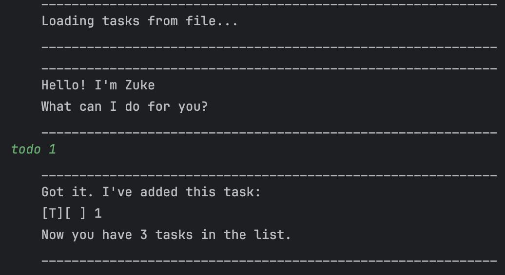

# Zuke User Guide



Zuke is a task management application designed to help you keep track of your todos, deadlines, and events. With Zuke,
you can easily add, delete, and manage tasks, ensuring you stay organized and on top of your schedule.

## Features

### 1. Add a Todo Task

To add a todo task, use the following command:

```plaintext
todo <description>
```

Example:

```plaintext
todo read book
```

This command adds a todo task with the description `read book`.

### 2. Add a Deadline Task

To add a deadline task, use the following command:

```plaintext
deadline <description> /by <yyyy/MM/dd> <HHmm>
```

Example:

```plaintext
deadline return book /by 2021/09/30 1800
```

This command adds a deadline task with the description `return book` and the deadline `30th September 2021, 6:00 PM`.

### 3. Add an Event Task

To add an event task, use the following command:

```plaintext
event <description> /from <yyyy/MM/dd> <HHmm> /to <yyyy/MM/dd> <HHmm>
```

Example:

```plaintext
event project meeting /from 2023/12/01 1400 /to 2023/12/01 1600
```

This command adds an event task with the description `project meeting` and the event timing
`1st December 2023, 2:00 PM to 4:00 PM`.

### 4. List all Tasks

To list all tasks, use the following command:

```plaintext
list
```

This command lists all tasks in the task list.

### 5. Mark a Task as Done

To mark a task as done, use the following command:

```plaintext
mark <task number>
```

Example:

```plaintext
mark 1
```

This command marks the task with task number `1` as done.

### 6. Unmark a Task

To unmark a task, use the following command:

```plaintext
unmark <task number>
```

Example:

```plaintext
unmark 1
```

This command unmarks the task with task number `1`.

### 7. Delete a Task

To delete a task, use the following command:

```plaintext
delete <task number>
```

Example:

```plaintext
delete 1
```

This command deletes the task with task number `1`.

### 8. Find Tasks

To find tasks by keyword, use the following command:

```plaintext
find <keyword>
```

Example:

```plaintext
find book
```

This command finds tasks with the keyword `book`.

### 9. List Tasks for a Specific Date

To list tasks for a specific date, use the following command:

```plaintext
on <yyyy/MM/dd>
```

Example:

```plaintext
on 2021/09/30
```

This command lists tasks for the date `30th September 2021`.

### 10. Exit the Application

To exit the application, use the following command:

```plaintext
bye
```

This command exits the application.

## Getting Started

1. Ensure you have Java `17` or above installed in your Computer.
2. Clone this repository.

```plaintext
git clone https://github.com/wongwh2002/ip.git
```

3. Navigate to the project folder.

```plaintext
cd ip
```

4. Run the application.

```plaintext
java -jar ip.jar
```

5. Start managing your tasks with Zuke!
sample test data
```bash
java -jar build/libs/ip-1.0-SNAPSHOT-all.jar < text-ui-test/input.txt
```


